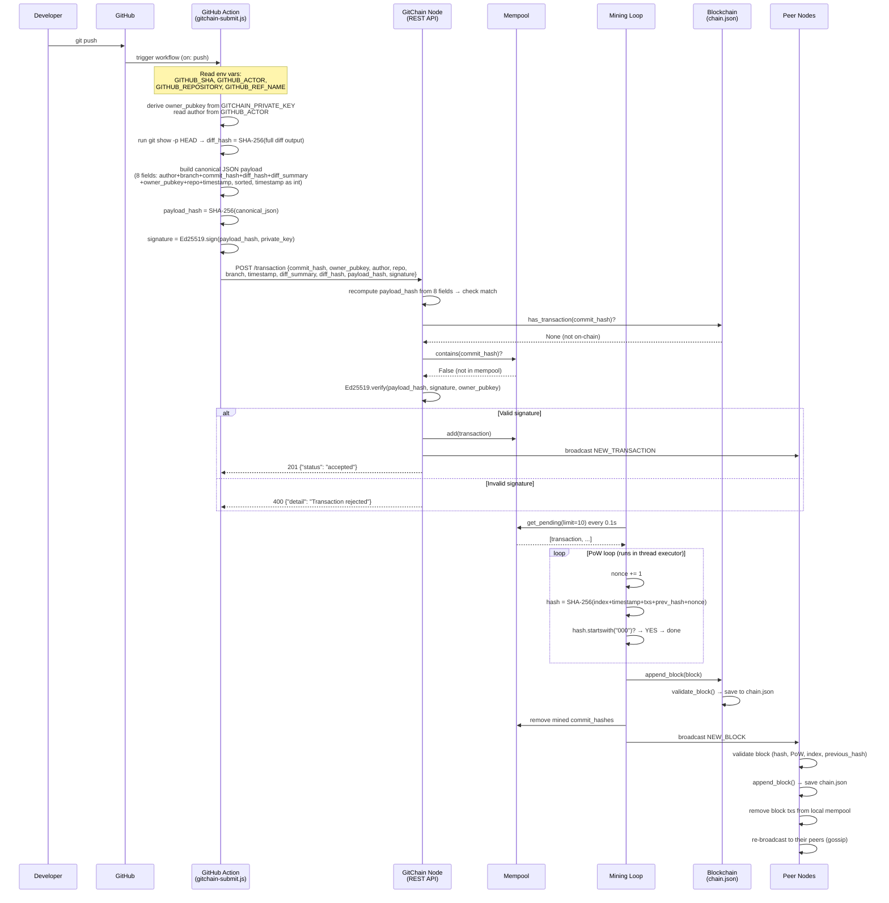

## Flow 1: From Git Push to On-Chain Record

Paste the code block below into any Mermaid renderer (mermaid.live, GitHub markdown, VS Code Mermaid extension, etc.)

```mermaid
sequenceDiagram
    participant Dev as Developer
    participant GH as GitHub
    participant Action as GitHub Action<br/>(gitchain-submit.js)
    participant Node as GitChain Node<br/>(REST API)
    participant Mem as Mempool
    participant Miner as Mining Loop
    participant Chain as Blockchain<br/>(chain.json)
    participant Peers as Peer Nodes

    Dev->>GH: git push
    GH->>Action: trigger workflow (on: push)

    Note over Action: Read env vars:<br/>GITHUB_SHA, GITHUB_ACTOR,<br/>GITHUB_REPOSITORY, GITHUB_REF_NAME

    Action->>Action: derive owner_pubkey from GITCHAIN_PRIVATE_KEY<br/>read author from GITHUB_ACTOR
    Action->>Action: run git show -p HEAD → diff_hash = SHA-256(full diff output)
    Action->>Action: build canonical JSON payload<br/>(8 fields: author+branch+commit_hash+diff_hash+diff_summary<br/>+owner_pubkey+repo+timestamp, sorted, timestamp as int)
    Action->>Action: payload_hash = SHA-256(canonical_json)
    Action->>Action: signature = Ed25519.sign(payload_hash, private_key)

    Action->>Node: POST /transaction {commit_hash, owner_pubkey, author, repo,<br/>branch, timestamp, diff_summary, diff_hash, payload_hash, signature}

    Node->>Node: recompute payload_hash from 8 fields → check match
    Node->>Chain: has_transaction(commit_hash)?
    Chain-->>Node: None (not on-chain)
    Node->>Mem: contains(commit_hash)?
    Mem-->>Node: False (not in mempool)
    Node->>Node: Ed25519.verify(payload_hash, signature, owner_pubkey)

    alt Valid signature
        Node->>Mem: add(transaction)
        Node->>Peers: broadcast NEW_TRANSACTION
        Node-->>Action: 201 {"status": "accepted"}
    else Invalid signature
        Node-->>Action: 400 {"detail": "Transaction rejected"}
    end

    Miner->>Mem: get_pending(limit=10) every 0.1s
    Mem-->>Miner: [transaction, ...]

    loop PoW loop (runs in thread executor)
        Miner->>Miner: nonce += 1
        Miner->>Miner: hash = SHA-256(index+timestamp+txs+prev_hash+nonce)
        Miner->>Miner: hash.startswith("000")? → YES → done
    end

    Miner->>Chain: append_block(block)
    Chain->>Chain: validate_block() → save to chain.json
    Miner->>Mem: remove mined commit_hashes
    Miner->>Peers: broadcast NEW_BLOCK

    Peers->>Peers: validate block (hash, PoW, index, previous_hash)
    Peers->>Peers: append_block() → save chain.json
    Peers->>Peers: remove block txs from local mempool
    Peers->>Peers: re-broadcast to their peers (gossip)
```
