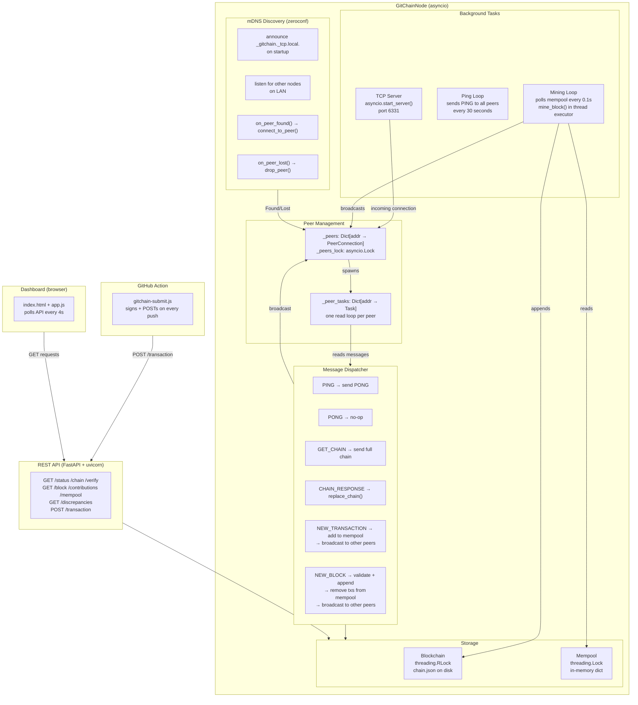

## Flow 2: Node Internal Architecture

```mermaid
graph TB
    subgraph Node["GitChainNode (asyncio)"]
        direction TB

        subgraph Tasks["Background Tasks"]
            Mining["Mining Loop<br/>polls mempool every 0.1s<br/>mine_block() in thread executor"]
            Ping["Ping Loop<br/>sends PING to all peers<br/>every 30 seconds"]
            Server["TCP Server<br/>asyncio.start_server()<br/>port 6331"]
        end

        subgraph PeerMgmt["Peer Management"]
            PeersDict["_peers: Dict[addr → PeerConnection]<br/>_peers_lock: asyncio.Lock"]
            PeerTasks["_peer_tasks: Dict[addr → Task]<br/>one read loop per peer"]
        end

        subgraph Dispatch["Message Dispatcher"]
            PING_H["PING → send PONG"]
            PONG_H["PONG → no-op"]
            GET_H["GET_CHAIN → send full chain"]
            CHAIN_H["CHAIN_RESPONSE → replace_chain()"]
            TX_H["NEW_TRANSACTION → add to mempool<br/>→ broadcast to other peers"]
            BLOCK_H["NEW_BLOCK → validate + append<br/>→ remove txs from mempool<br/>→ broadcast to other peers"]
        end

        subgraph Storage["Storage"]
            Blockchain["Blockchain<br/>threading.RLock<br/>chain.json on disk"]
            Mempool["Mempool<br/>threading.Lock<br/>in-memory dict"]
        end

        subgraph mDNS["mDNS Discovery (zeroconf)"]
            Announce["announce _gitchain._tcp.local.<br/>on startup"]
            Listen["listen for other nodes<br/>on LAN"]
            Found["on_peer_found() → connect_to_peer()"]
            Lost["on_peer_lost() → drop_peer()"]
        end
    end

    subgraph API["REST API (FastAPI + uvicorn)"]
        Routes["GET /status /chain /verify<br/>GET /block /contributions /mempool<br/>GET /discrepancies<br/>POST /transaction"]
    end

    subgraph GitHub["GitHub Action"]
        Action["gitchain-submit.js<br/>signs + POSTs on every push"]
    end

    subgraph Dashboard["Dashboard (browser)"]
        SPA["index.html + app.js<br/>polls API every 4s"]
    end

    Server -->|incoming connection| PeersDict
    PeersDict -->|spawns| PeerTasks
    PeerTasks -->|reads messages| Dispatch
    Dispatch --> Storage
    Dispatch -->|broadcast| PeersDict
    Mining -->|reads| Mempool
    Mining -->|appends| Blockchain
    Mining -->|broadcasts| PeersDict
    mDNS -->|Found/Lost| PeersDict
    API --> Storage
    GitHub -->|POST /transaction| API
    Dashboard -->|GET requests| API
```
