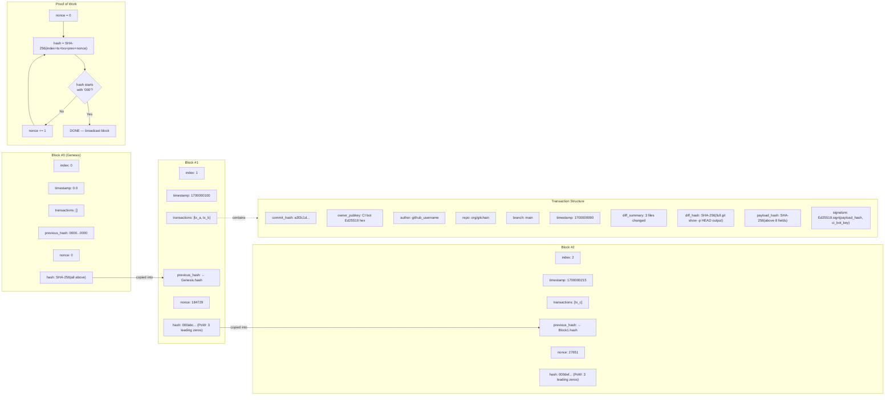

## Flow 3: Blockchain Data Model and Hash Chain

```mermaid
graph LR
    subgraph Genesis["Block #0 (Genesis)"]
        G_idx["index: 0"]
        G_ts["timestamp: 0.0"]
        G_txs["transactions: []"]
        G_prev["previous_hash: 0000...0000"]
        G_nonce["nonce: 0"]
        G_hash["hash: SHA-256(all above)"]
    end

    subgraph Block1["Block #1"]
        B1_idx["index: 1"]
        B1_ts["timestamp: 1700000100"]
        B1_txs["transactions: [tx_a, tx_b]"]
        B1_prev["previous_hash: ← Genesis.hash"]
        B1_nonce["nonce: 184729"]
        B1_hash["hash: 000abc... (PoW: 3 leading zeros)"]
    end

    subgraph Block2["Block #2"]
        B2_idx["index: 2"]
        B2_ts["timestamp: 1700000215"]
        B2_txs["transactions: [tx_c]"]
        B2_prev["previous_hash: ← Block1.hash"]
        B2_nonce["nonce: 27651"]
        B2_hash["hash: 000def... (PoW: 3 leading zeros)"]
    end

    G_hash -->|copied into| B1_prev
    B1_hash -->|copied into| B2_prev

    subgraph TX["Transaction Structure"]
        TX_commit["commit_hash: a3f2c1d..."]
        TX_owner["owner_pubkey: CI bot Ed25519 hex"]
        TX_author["author: github_username"]
        TX_repo["repo: org/gitchain"]
        TX_branch["branch: main"]
        TX_time["timestamp: 1700000090"]
        TX_diff["diff_summary: 3 files changed"]
        TX_diffhash["diff_hash: SHA-256(full git show -p HEAD output)"]
        TX_phash["payload_hash: SHA-256(above 8 fields)"]
        TX_sig["signature: Ed25519.sign(payload_hash, ci_bot_key)"]
    end

    B1_txs -.->|contains| TX

    subgraph PoW["Proof of Work"]
        PoW1["nonce = 0"]
        PoW2["hash = SHA-256(index+ts+txs+prev+nonce)"]
        PoW3{hash starts\nwith '000'?}
        PoW4["nonce += 1"]
        PoW5["DONE — broadcast block"]
        PoW1 --> PoW2 --> PoW3
        PoW3 -->|No| PoW4 --> PoW2
        PoW3 -->|Yes| PoW5
    end
```
