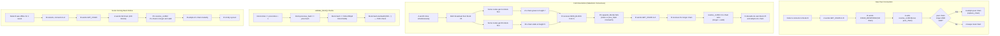

## Flow 4: Nakamoto Consensus and Chain Sync

```mermaid
flowchart TD
    subgraph Connect["New Peer Connection"]
        C1["Node A connects to Node B"]
        C2["A sends GET_CHAIN to B"]
        C3["B sends CHAIN_RESPONSE (full chain)"]
        C4["A calls resolve_conflict(local, peer_chain)"]
        C5{peer chain\nlonger AND\nvalid?}
        C6["A adopts peer chain\n(replace_chain)"]
        C7["A keeps local chain"]
        C1 --> C2 --> C3 --> C4 --> C5
        C5 -->|Yes| C6
        C5 -->|No| C7
    end

    subgraph Fork["Fork Resolution (Nakamoto Consensus)"]
        F1["A and B mine simultaneously"]
        F2["Both broadcast their block #5"]
        F3["Some nodes get A's block first"]
        F4["Some nodes get B's block first"]
        F5["A's chain grows to height 7"]
        F6["B's chain stalls at height 5"]
        F7["B receives NEW_BLOCK from A"]
        F8["B's append_block() fails\n(index or prev_hash mismatch)"]
        F9["B sends GET_CHAIN to A"]
        F10["B receives A's longer chain"]
        F11["resolve_conflict: A's chain wins\n(longer + valid)"]
        F12["B discards its own block #5\nand adopts A's chain"]

        F1 --> F2 --> F3 & F4
        F3 --> F5
        F4 --> F6
        F5 --> F7
        F6 --> F7
        F7 --> F8 --> F9 --> F10 --> F11 --> F12
    end

    subgraph Validate["validate_block() checks"]
        V1["block.index == prev.index + 1"]
        V2["block.previous_hash == prev.hash"]
        V3["block.hash == SHA-256(all block fields)"]
        V4["block.hash.startswith('000...') — PoW check"]
        V1 --> V2 --> V3 --> V4
    end

    subgraph Sync["Node Coming Back Online"]
        S1["Node B was offline for 1 week"]
        S2["B restarts, connects to A"]
        S3["B sends GET_CHAIN"]
        S4["A sends full chain (100 blocks)"]
        S5["B's resolve_conflict:\nA's chain is longer and valid"]
        S6["B adopts A's chain instantly"]
        S7["B is fully synced"]
        S1 --> S2 --> S3 --> S4 --> S5 --> S6 --> S7
    end
```
