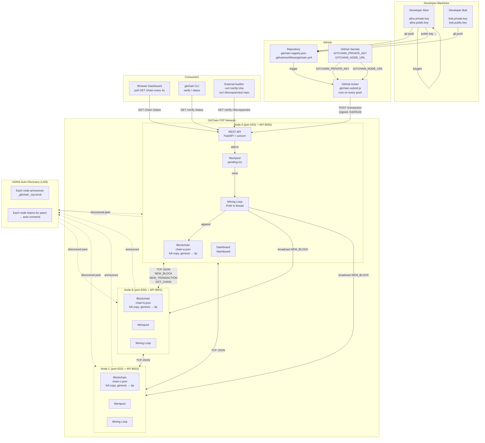

## Flow 5: Full System Overview (All Components)

```mermaid
graph TB
    subgraph Developers["Developer Machines"]
        Dev1["Developer Alice\n\nalice.private.key\nalice.public.key"]
        Dev2["Developer Bob\n\nbob.private.key\nbob.public.key"]
    end

    subgraph GitHub["GitHub"]
        Repo["Repository\ngitchain-registry.json\n.github/workflows/gitchain.yml"]
        Secrets["GitHub Secrets\nGITCHAIN_PRIVATE_KEY\nGITCHAIN_NODE_URL"]
        Action["GitHub Action\ngitchain-submit.js\nruns on every push"]
    end

    subgraph Network["GitChain P2P Network"]
        subgraph NodeA["Node A (port 6331 + API 8000)"]
            NA_chain["Blockchain\nchain-a.json\nfull copy, genesis → tip"]
            NA_mem["Mempool\npending txs"]
            NA_miner["Mining Loop\nPoW in thread"]
            NA_api["REST API\nFastAPI + uvicorn"]
            NA_dash["Dashboard\n/dashboard"]
        end

        subgraph NodeB["Node B (port 6331 + API 8001)"]
            NB_chain["Blockchain\nchain-b.json\nfull copy, genesis → tip"]
            NB_mem["Mempool"]
            NB_miner["Mining Loop"]
        end

        subgraph NodeC["Node C (port 6331 + API 8002)"]
            NC_chain["Blockchain\nchain-c.json\nfull copy, genesis → tip"]
            NC_mem["Mempool"]
            NC_miner["Mining Loop"]
        end

        NodeA <-->|"TCP JSON\nNEW_BLOCK\nNEW_TRANSACTION\nGET_CHAIN"| NodeB
        NodeA <-->|"TCP JSON"| NodeC
        NodeB <-->|"TCP JSON"| NodeC
    end

    subgraph Consumers["Consumers"]
        Browser["Browser Dashboard\npoll GET /chain every 4s"]
        CLI["gitchain CLI\nverify / status"]
        Auditor["External Auditor\ncurl /verify/:sha\ncurl /discrepancies/:repo"]
    end

    Dev1 -->|git push| Repo
    Dev2 -->|git push| Repo
    Repo -->|trigger| Action
    Secrets -->|GITCHAIN_PRIVATE_KEY| Action
    Secrets -->|GITCHAIN_NODE_URL| Action
    Action -->|"POST /transaction\n(signed, Ed25519)"| NA_api

    NA_api -->|add to| NA_mem
    NA_mem -->|mine| NA_miner
    NA_miner -->|append| NA_chain
    NA_miner -->|broadcast NEW_BLOCK| NodeB & NodeC

    Dev1 -->|keygen| Dev1
    Dev1 -->|public key →| Repo

    Browser -->|GET /chain /status| NA_api
    CLI -->|GET /verify /status| NA_api
    Auditor -->|GET /verify /discrepancies| NA_api

    subgraph mDNS["mDNS Auto-Discovery (LAN)"]
        mdns_announce["Each node announces\n_gitchain._tcp.local."]
        mdns_listen["Each node listens for peers\n→ auto-connects"]
    end

    NodeA -.->|announces| mDNS
    NodeB -.->|announces| mDNS
    NodeC -.->|announces| mDNS
    mDNS -.->|discovered peer| NodeA & NodeB & NodeC
```
