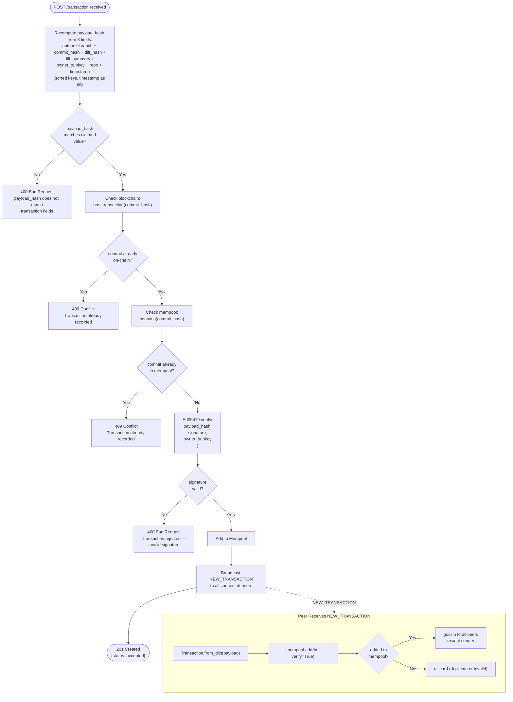

## Flow 6: Transaction Validation Pipeline

```mermaid
flowchart TD
    Start(["POST /transaction received"])

    Start --> V1["Recompute payload_hash from 8 fields:\nauthor + branch + commit_hash + diff_hash +\ndiff_summary + owner_pubkey + repo + timestamp\n(sorted keys, timestamp as int)"]

    V1 --> C1{payload_hash\nmatches claimed\nvalue?}
    C1 -->|No| R1["400 Bad Request\npayload_hash does not match\ntransaction fields"]

    C1 -->|Yes| V2["Check blockchain:\nhas_transaction(commit_hash)"]
    V2 --> C2{commit already\non-chain?}
    C2 -->|Yes| R2["409 Conflict\nTransaction already recorded"]

    C2 -->|No| V3["Check mempool:\ncontains(commit_hash)"]
    V3 --> C3{commit already\nin mempool?}
    C3 -->|Yes| R3["409 Conflict\nTransaction already recorded"]

    C3 -->|No| V4["Ed25519.verify(\n  payload_hash,\n  signature,\n  owner_pubkey\n)"]
    V4 --> C4{signature\nvalid?}
    C4 -->|No| R4["400 Bad Request\nTransaction rejected —\ninvalid signature"]

    C4 -->|Yes| A1["Add to Mempool"]
    A1 --> A2["Broadcast NEW_TRANSACTION\nto all connected peers"]
    A2 --> A3(["201 Created\n{status: accepted}"])

    subgraph Peer["Peer Receives NEW_TRANSACTION"]
        P1["Transaction.from_dict(payload)"]
        P2["mempool.add(tx, verify=True)"]
        P3{added to\nmempool?}
        P4["gossip to all peers\nexcept sender"]
        P5["discard (duplicate or invalid)"]
        P1 --> P2 --> P3
        P3 -->|Yes| P4
        P3 -->|No| P5
    end

    A2 -.->|NEW_TRANSACTION| Peer
```
